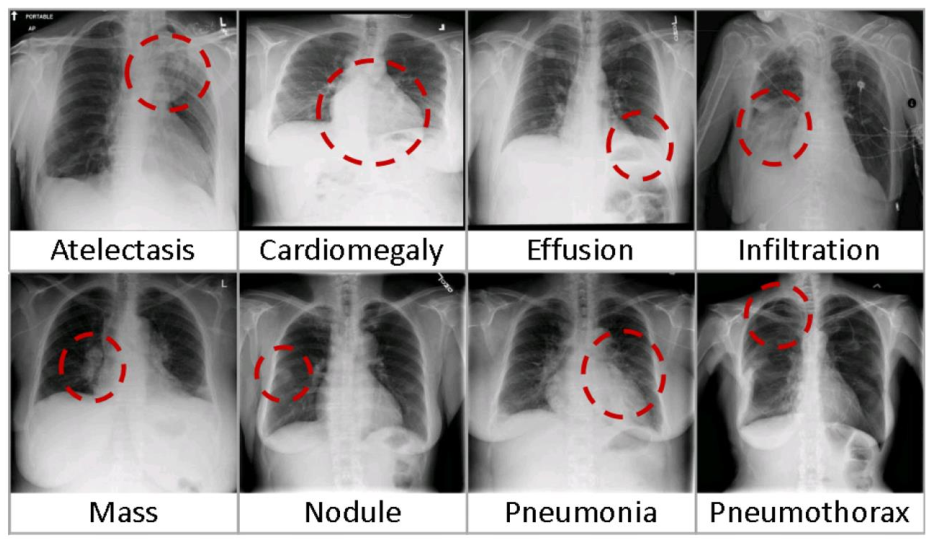
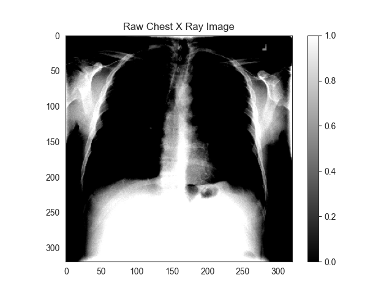
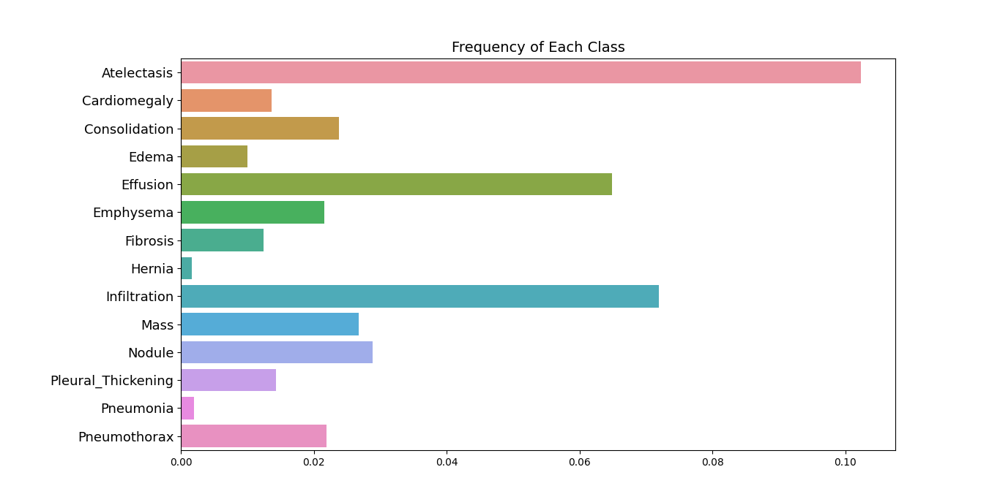
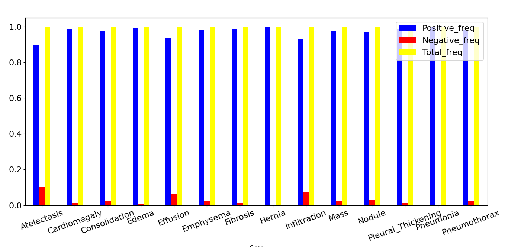

# Chest X-ray Diagnoisis
In this project chest x-ray classification is presented.
<figure>

<figcaption> normalized image</figcaption>
</figure>

Classes:
- 1, Atelectasis; 2, Cardiomegaly; 3, Effusion; 4, Infiltration; 5, Mass; 6, Nodule; 7, Pneumonia; 8,
Pneumothorax; 9, Consolidation; 10, Edema; 11, Emphysema; 12, Fibrosis; 13,
Pleural_Thickening; 14 Hernia
## Dataset
original dataset contains - 108,948 frontal-view X-ray images of 32,717 unique patients.

But we are using only 10,000 image for the training, tesing and validating. 
Training images - 8000 
validation images - 1400
Testing images - 2000
## Data analysis(EDA)
For the purpose of analysisng the dataset, module "data_analysis.py" is created. This module has a class Data_analysis. The methods associated to that class are 
1. data_insight()
2. image_visualization()
3. pixel_distrubution()
4. class_imblance_predection()

## Data Preprocessing

<figure>

<figcaption> normalized image</figcaption>
</figure>
Normalize images : new mean of the data will be zero, and the standard deviation of the data will be 1. In other words each pixel value in the image with a new value calculated by subtracting the mean and dividing by the standard deviation.

## Challanges in medical dataset
## Class imbalance
<figure>

<figcaption> class frequency</figcaption>
</figure>

<figure>

<figcaption> Positive and Negative frequency</figcaption>
</figure>

## Logistics regression cost function(Binary cross entropy) Vs Weight loss function 

## Densnet

## Acknowledgement  
1. NIH clinical center 
 
